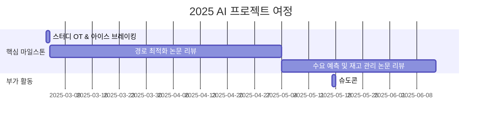

# AI in Logistics & Transportation  

<h1 align="center"> AI in Logistics & Transportation   </h1>

 

<!-- sheilds: https://shields.io/ -->
<!-- hits badge: https://hits.seeyoufarm.com/ -->

> Welcome to ALT (AI in Logistics & Transportation) Study Group! We explore AI applications in transportation and logistics, focusing on route optimization and demand forecasting. Join us in advancing smart mobility through collaboration and innovation!!

안녕하세요! ALT(AI in Logistics & Transportation) 스터디는 물류와 교통 산업에서 AI가 어떻게 혁신을 이끌어내는지 함께 공부하고 싶은 열정 가득한 분들을 찾고 있습니다.

## 🌟 Why This Study?
"오늘 저녁은 배달 음식 시켜 먹을까?" 한번쯤 고민해보셨죠? 코로나19 이후 배달앱으로 음식 주문하기, 온라인 쇼핑 택배 받기 등.. 

우리의 생활 패턴이 바뀌면서 물류와 교통 산업은 큰 변화의 시기를 맞이했습니다. 택배, 음식 배달, 카풀 서비스 등 우리 생활과 밀접한 서비스들이 폭발적으로 성장했고, 이에 따라 산업 전반의 혁신이 필요한 상황입니다.
이러한 변화의 중심에서 AI 기술은 핵심 해결책으로 떠오르고 있습니다. 실시간 교통 상황을 반영한 최적 경로 설계, 정확한 수요 예측을 통한 효율적인 배차와 물류 관리까지, AI는 이미 교통·물류 산업의 게임 체인저가 되어가고 있습니다.

더 스마트하고 효율적인 미래 교통·물류 시스템을 만들어갈 여정, 함께하지 않으시겠습니까?

## 🌟 우리는 이런 것을 함께 공부합니다
_"AI 기술로 선도하는 Logistics & Transportation 스터디"_  
- 최신 AI 기술(GNN, 강화학습)을 활용한 경로 최적화 방법
- 시계열 분석과 딥러닝을 통한 수요 예측 노하우
- 실제 현장에서 발생하는 문제들에 대한 AI 솔루션 연구

## 🌟 이런 분들과 함께하고 싶어요
- 교통·물류 산업의 미래를 AI와 함께 그려보고 싶은 분
- 이론적 지식을 실제 문제 해결에 적용해보고 싶은 분
- 관련 분야의 경험을 나누며 함께 성장하고 싶은 분
- 새로운 기술을 배우는 것을 즐기시는 분

## 🧑 역동적인 팀 소개 (Dynamic Team)

| 역할          | 이름 |  기술 스택 배지                                                                 | 주요 관심 분야                          |
|---------------|------|-----------------------------------------------------------------------|----------------------------------------|
| **Project Manager** | 김성희 |   | Transportation, Logistics, Mobility, Optimization, GNN, Time Series Forecasting             |
| **Member** | 레오나르도 다빈치 |   | 데이터 파이프라인 설계                  |

## 🚀 프로젝트 로드맵 (Project Roadmap)

## 🛠️ 우리의 스터디 문화 (Our Study Culture)
**우리의 스터디 문화**  

- communication': 'Discord',
'version_control': 'GitHub Projects',
'docs': 'Github Wiki'
    

## 📈 성과 지표 (Achievement Metrics)
**2024 주요 KPI**  
| 지표                     | 목표치 | 현재 달성률 |
|--------------------------|--------|-------------|
| 논문 리뷰 블로그 게시물                 | 14  | 0%         |

## 💻 주차별 활동 (Activity History)

| 날짜 | 내용 | 발표자 | 
| -------- | -------- | ---- |
| 2025/03/04 | OT       |      |
| 2025/03/11 |  Part 1. | 미정 | 
| 2025/03/18 |  Part 2. | 미정 | 
| 2025/03/25 |  Part 3. | 미정 | 
| 2025/04/01 |  Part 4. | 미정 |
| 2025/04/08 |  Part 5. | 미정 |
| 2025/04/15 |  Part 6. | 미정 |
| 2025/04/22 |  Part 7. | 미정 | 
| 2025/04/29 |  Part 8. | 미정 |
| 2025/05/06 |  임시공휴일 | 미정 |
| 2025/05/13 |  Part 9. | 미정 |
| 2025/05/20 |  Part 10. | 미정 |
| 2025/05/27 |  Part 11. | 미정 |
| 2025/06/03 |  Part 12. | 미정 |
| 2025/06/10 |  Part 13. | 미정 |
| 2025/06/17 |  Part 14. | 미정 |
| 2025/06/24 |  스터디 종료 및 회고 | 미정 |

## 💡 학습 자원 (Learning Resources)
**우리가 만든 지식 허브**  
- 

## 🌱 참여 안내 (How to Engage)
**팀원으로 참여하시려면 러너 모집 기간에 신청해주세요.**  
- 링크 (준비중)

**누구나 청강을 통해 모임을 참여하실 수 있습니다.**  
1. 특별한 신청 없이 정기 모임 시간에 맞추어 디스코드 #Room-SH 채널로 입장
2. Magical Week 중 행사에 참가
3. Pseudo Lab 행사에서 만나기

## Acknowledgement 🙏

ALT(AI in Logistics & Transportation) Study is developed as part of Pseudo-Lab's Open Research Initiative. Special thanks to our contributors and the open source community for their valuable insights and contributions.

## About Pseudo Lab 👋🏼</h2>

[Pseudo-Lab](https://pseudo-lab.com/) is a non-profit organization focused on advancing machine learning and AI technologies. Our core values of Sharing, Motivation, and Collaborative Joy drive us to create impactful open-source projects. With over 5k+ researchers, we are committed to advancing machine learning and AI technologies.

<h2>Contributors 😃</h2>

  

<h2>License 🗞</h2>

This project is licensed under the [MIT License](https://opensource.org/licenses/MIT).
