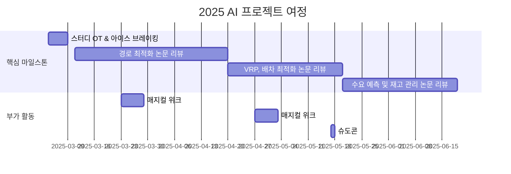

# AI in Logistics & Transportation  

<h1 align="center"> AI in Logistics & Transportation   </h1>

 

<!-- sheilds: https://shields.io/ -->
<!-- hits badge: https://hits.seeyoufarm.com/ -->

> Welcome to ALT (AI in Logistics & Transportation) Study Group! We explore AI applications in transportation and logistics, focusing on route optimization and demand forecasting. Join us in advancing smart mobility through collaboration and innovation!!

안녕하세요! ALT(AI in Logistics & Transportation) 스터디는 물류와 교통 산업에서 AI가 어떻게 혁신을 이끌어내는지 함께 공부하고 싶은 열정 가득한 분들을 찾고 있습니다.❤️‍🔥🚛❤️‍🔥

## 🌟 Why This Study?
"오늘 저녁은 배달 음식 시켜 먹을까?" 한번쯤 고민해보셨죠? 코로나19 이후 배달앱으로 음식 주문하기, 온라인 쇼핑 택배 받기 등.. 

우리의 생활 패턴이 바뀌면서 물류와 교통 산업은 큰 변화의 시기를 맞이했습니다. 택배, 음식 배달, 카풀 서비스 등 우리 생활과 밀접한 서비스들이 폭발적으로 성장했고, 이에 따라 산업 전반의 혁신이 필요한 상황입니다.
이러한 변화의 중심에서 AI 기술은 핵심 해결책으로 떠오르고 있습니다. 실시간 교통 상황을 반영한 최적 경로 설계, 정확한 수요 예측을 통한 효율적인 배차와 물류 관리까지, AI는 이미 교통·물류 산업을 혁신하는 방안이 되어가고 있습니다.

더 스마트하고 효율적인 미래 교통·물류 시스템을 만들어갈 여정, 함께하지 않으시겠습니까? 
  
## 🌟 우리는 이런 것을 함께 공부합니다
_"AI 기술로 선도하는 Logistics & Transportation 스터디!!"_  
- 최신 AI 기술(GNN, 강화학습)을 활용한 경로 최적화 방법
- 다양한 제약조건에서 배차 솔루션(VRP, Vehicle Routing Problem) 도출
- 시계열 분석과 딥러닝을 통한 수요 예측 노하우
- 실제 물류 및 교통에서 발생하는 문제들에 대한 AI 솔루션 연구
  
## 🌟 이런 분들과 함께하고 싶어요
- 교통·물류 산업의 미래를 AI와 함께 그려보고 싶은 분
- 쿠팡, 배달의 민족 등 물류 산업에 기여하고 싶은 분
- 교통량 예측, GIS 데이터 분석, 최적화, 시계열 분석에 관심 있는 분
- 이론적 지식 논문 리뷰를 통해 얻고, 얻은 지식을 실제 문제 해결에 적용해보고 싶은 분
- 논문을 빠르게 읽고 요약하는 스킬을 기르고 싶은 분
  
## 🌟 스터디는 이렇게 진행해요
- 스터디는 매주 화요일 20:00에 진행합니다. (소요시간 : 1시간 - 1시간 30분 정도 예상)
- 발표자는 발표 1주일 전에 선정한 논문을 공유합니다. (논문 선정이 어렵다면, 다른 팀원이 추천하거나 스터디 장이 선정합니다!)
- 발표는 30분, 질의응답 & 토론은 30분 정도 진행합니다.
- 우리의 첫 만남, OT는 오프라인으로 진행하고 발표 순서를 정합니다.

💚 **발표자 역할** 💚
- 논문 선정 후 1주일 전 공유
- 발표 자료 1일 전까지 깃허브에 업로드

💛 **참여자 역할** 💛
- 논문 사전 읽기
- 최소 1개 이상 질문 준비
- 실무 적용 아이디어 고민

🌌 공유 플랫폼 🌌
- GitHub: 논문 리뷰 발표자료
- Discord: 일상적 소통

💡 Point: "준비는 철저하게, 토론은 자유롭게"

## 🧑 역동적인 팀 소개 (Dynamic Team)

| 역할          | 이름 |  기술 스택 배지                                                                 | 주요 관심 분야                          |
|---------------|------|-----------------------------------------------------------------------|----------------------------------------|
| **Project Manager** | 김성희 |   | Transportation, Logistics, Mobility, Optimization, GNN, Time Series Forecasting             |
| **Member** | 레오나르도 다빈치 |   | 데이터 파이프라인 설계                  |

## 🚀 프로젝트 로드맵 (Project Roadmap)

## 🛠️ 우리의 스터디 문화 (Our Study Culture)
**1. Be Active, Be Creative**
- 적극적인 참여와 질문하기
- 자유로운 아이디어 공유
- 실수를 두려워하지 않기!!!

**2. Focus on Real World**
- 이론과 실무 연결하여 문제 해결에 집중하기
- 현장 사례 공유하기

**3. Grow Together**
- 서로의 전문성 존중하기
- 건설적인 피드백 나누기

## 📈 성과 지표 (Achievement Metrics)
**2024 주요 KPI**  
| 지표                     | 목표치 | 현재 달성률 |
|--------------------------|--------|-------------|
| 논문 리뷰 블로그 게시물                 | 12  | 0%         |

## 💻 주차별 활동 (Activity History)

| 날짜 | 내용 | 발표자 | 
| -------- | -------- | ---- |
| 2025/03/04 | OT(오프라인으로 진행)       |    |
| 2025/03/11 |  Part 1. 경로 최적화 분야 논문 리뷰 1 | 미정 | 
| 2025/03/18 |  Part 2. 경로 최적화 분야 논문 리뷰 2| 미정 | 
| 2025/03/25 |  ✨Magical Week✨ | 미정 | 
| 2025/04/01 |  Part 3. 경로 최적화 분야 논문 리뷰 3 | 미정 |
| 2025/04/08 |  Part 4. 경로 최적화 분야 논문 리뷰 4 | 미정 |
| 2025/04/15 |  Part 5. 배차 솔루션(VRP) 분야 논문 리뷰 1 | 미정 |
| 2025/04/22 |  Part 6. 배차 솔루션(VRP) 분야 논문 리뷰 2 | 미정 | 
| 2025/04/29 |  ✨Magical Week✨ | 미정 |
| 2025/05/06 |  임시공휴일 | 미정 |
| 2025/05/13 |  Part 7. 배차 솔루션(VRP) 분야 논문 리뷰 3 | 미정 |
| 2025/05/20 |  Part 8. 배차 솔루션(VRP) 분야 논문 리뷰 4 | 미정 |
| 2025/05/27 |  Part 9. 시계열 분석기반 수요 예측 분야 논문 리뷰 1 | 미정 |
| 2025/06/03 |  Part 10. 시계열 분석기반 수요 예측 분야 논문 리뷰 2 | 미정 |
| 2025/06/10 |  Part 11. 시계열 분석기반 수요 예측 분야 논문 리뷰 3 | 미정 |
| 2025/06/17 |  Part 12. 시계열 분석기반 수요 예측 분야 논문 리뷰 4 | 미정 |

## 💡 학습 자원 (Learning Resources)
아래 저널의 논문을 선택하여 리뷰를 진행합니다. 다른 저널의 논문도 괜찮습니다. 다만, 인용 수가 많은 논문이나 최신 트렌드가 반영된 논문으로 진행합니다.
- [Transportation Research Part C: Emerging Technologies](https://www.sciencedirect.com/journal/transportation-research-part-c-emerging-technologies)
- [IEEE Transactions on Intelligent Transportation Systems](https://ieeexplore.ieee.org/xpl/RecentIssue.jsp?punumber=6979)
- [Transportation Science](https://pubsonline.informs.org/journal/trsc)

## 🌱 참여 안내 (How to Engage)
**팀원으로 참여하시려면 러너 모집 기간에 신청해주세요.**  
- 링크 (준비중)

**누구나 청강을 통해 모임을 참여하실 수 있습니다.**  
1. 특별한 신청 없이 정기 모임 시간에 맞추어 디스코드 #Room-GH 채널로 입장
2. Magical Week 중 행사에 참가
3. Pseudo Lab 행사에서 만나기
  
## Acknowledgement 🙏

ALT(AI in Logistics & Transportation) Study is developed as part of Pseudo-Lab's Open Research Initiative. Special thanks to our contributors and the open source community for their valuable insights and contributions.

## About Pseudo Lab 👋🏼</h2>

[Pseudo-Lab](https://pseudo-lab.com/) is a non-profit organization focused on advancing machine learning and AI technologies. Our core values of Sharing, Motivation, and Collaborative Joy drive us to create impactful open-source projects. With over 5k+ researchers, we are committed to advancing machine learning and AI technologies.

<h2>License 🗞</h2>

This project is licensed under the [MIT License](https://opensource.org/licenses/MIT).
